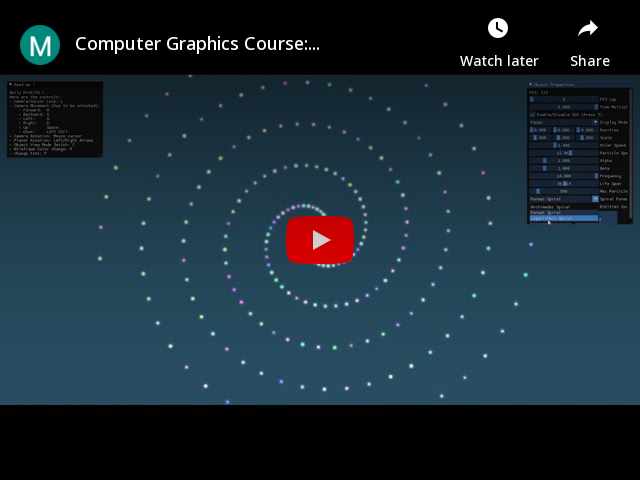

# Assignment 3 of Fundamentals of Computer Graphics: Star Rotation

    

# Introduction

For this assignment, the main theme was `Stars Rotation`.

The objectives here were:

1. Multiple stars rotate around a center.
2. The colors of stars are different.
3. Stars rotate and spread out in spiral path.
4. Choose a spiral type in Archimedes spiral, Fermat spiral and logarithmic spiral.

# Compilation

This project and all of my CG projects will be compiled with CMake, if you open the project directly with Visual Studio, you should be able to directly compile it.
Though, as CMake permits it, you will be easily able to compile on other platforms.

# Demonstration

## Content

For my Assignment, I got all these points covered:

- Starts rotate around a center
- Colors of stars are different
- Stars rotate/spread around in spiral path
- All spiral formulas are covered (Archimedes, Fermat & Logarithmic)
- Bonus:
    - Camera Movement + Rotation (can be enabled/disabled)
    - Display Mode (Vertices, Wireframe, Faces)
    - Enable/Disable GUI
    - Particle Systems parameters can be edited
    - The 3 spiral types can be tested

## How to use it

You can launch the `Assignment3.exe`directly, if you already have Visual C++ Redistribuable.

The program was compiled in Release mode.

As it is displayed in the program, here are the controls by order of priority for the assignment:

## Controls

- Change Font: F
- Enable/Disable GUI: T
- Object View Mode Switch: C
- Wireframe Color Change: P
- Camera/Cursor Lock: L
- Camera Movement:
    - Forward: W (or Z on AZERTY layout)
    - Backward: S
    - Left: A (or Q on AZERTY layout)
    - Right: D
    - Up: Space
    - Down: Left CTRL

## Additional Interactions

- You can change every parameters related to the particle systems lile:
    - Particle Speed
    - Polar Speed
    - Alpha & Beta of the formulas
    - Frequency of emitted particles (particles/second)
    - Life Span of each particle (in seconds)
    - Maximum count of Particles
    - Change the Spiral Formula
- You can change the Display Mode on the `Display Mode`menu.
- You can change the FPS cap/limit
- You can change the Time multiplier (multiplies deltaTime)

# Code Architecture

The Complete Documentation is available in the project, in the Code Architecture part will only be explained a small description of what classes do.

## Documentation

There is a documentation available [here](https://kevinpruvost.github.io/ComputerGraphics_Assignment2/) or in `docs/index.html` if you want to have a better view on the classes I made.

## DebugInfo

Contains classes and code about Debugging & Logging information about the studied and tested processes.

### Log

Centralizes the whole logging process.

## Shaders

### Shader_Base

Contains every variables used for OpenGL to manage every shader operations, through construction/deletion to writing variables to the GPU...

### Shader

Contains an ID to a Shader_Base object so that Entities can carry shaders with a lighter structure.

## Meshes

### Face

Face structure, contains indices to vertex positions, normals and texture coordinates.

### Vertex

Simple Vertex structure (x y z).

### VertexNormalTexture

Vertex structure also containing normals and texture coordinates (x y z, nx ny nz, s t).

### Mesh_Base

Base class of all meshes.

### Mesh_Sphere

Sphere Mesh constructed from sphere parameters.

### Mesh_Obj

Mesh constructed from an Obj object, to load .obj files into meshes.

### Mesh

Contains an ID to a Mesh_Base object so that Entities can carry meshes with a lighter structure.

## Light

### LightRendering

Static class taking care of Light Rendering and UBO data related processes.

### PointLight

Point Light class, treated as an Entity, it also contains parameters for light rendering. 

### PointLight_Shader

Structure containing every needed information for shaders to render light on objects. The most important feature of this structure is that it is adapted to the std140 layout.

## Entities

### Entity_Skeleton

Base class of Entities.

### Entity

Manages key composants of an entities such as position, rotation, shaders, meshes, calculating needed matrices, ...

## Text

### Character

Contains and manages information about characters loaded from fonts.

### Font_Base

Carries information about loaded fonts, characters and all needed metrics.

### Font

Only carries an ID to a Font_Base object to make fonts usage lighter.

### Text2D

2D text only rendered directly on the Camera’s screen, not considering the 3D Point of View.

### Text3D

Treated as an Entity, has the particularity to carry information about rendering a 3D text, billboarding is active on these instances.

## Particle Systems

### Particle_Base

Defines the basis, virtual functions, attributes & methods of all particles that could serve for particle systems.

### ParticleSystem_Base

Defines the basis, virtual functions, attributes & methods of all particle systems so that the Rendering and overall external usage of particle systems will always be consistent.

### Particle_Spiral

Specialized Particle for spirals.

### ParticleSystem_Spiral

Specialized Particle System for spirals.

## Rendering

### Rendering

Handles everything about rendering all types of Entities.

### ParticleSystemRendering

Handles everything about rendering all types of Particle Systems.

## General

### Camera

Manages everything about the point of view we need for the view matrix.

### GUI

Manages the overall GUI, mostly written with https://github.com/ocornut/imgui.

### Input

Manages everything related to input from keyboard and mouse.

### Obj

.obj files Parsing/Loading class, for now, only vertices & triangle faces are handled.

### Window

Inherits Input and manages everything about the OpenGL window.

### OpenGL_Timer

Timer based on GPU time metrics.

### Texture

Contains and loads everything about textures.

### Quaternion

Serves as a basis for rotation purposes.
